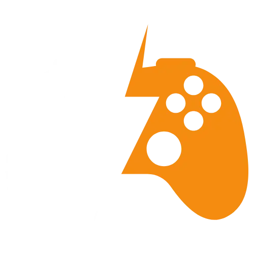

# GameHub - Vite TypeScript Project



GameHub is a web application built with Vite and TypeScript that allows users to explore and discover various games using the RAWG API. The application provides a user-friendly interface to browse through an extensive collection of games, view game details, and find information about different platforms, genres, and more.

## Introduction

GameHub is a web application built with Vite and TypeScript, developed as a practice project to learn TypeScript. The application utilizes the RAWG API for fetching game data, allowing users to explore and discover various games easily. This project serves as an educational initiative to understand TypeScript's benefits in web development and enhance skills in building modern web applications.

## Features

- Browse and search for games using the RAWG API.
- View detailed information about each game, including release date, platforms, genres, and more.
- Explore games based on specific genres and platforms.
- User-friendly interface with a responsive design for various devices.

## Installation

Follow these steps to set up the GameHub project on your local machine:

1. Clone the repository to your local machine using the following command:
   ```
   git clone https://github.com/azimifardous/gamehub-ts.git
   ```

2. Change the directory to the GameHub project folder:
   ```
   cd gamehub-ts
   ```

3. Install the project dependencies using npm or yarn:
   ```
   npm install
   # or
   yarn install
   ```

## Usage

To run the GameHub project locally, execute the following command:

```
npm run dev
# or
yarn dev
```

This command will start the development server, and you can access the application at `http://localhost:5173` in your web browser.

## Technologies Used

The GameHub project uses the following technologies:

- Vite: A fast build tool and development server for modern web projects.
- TypeScript: A typed superset of JavaScript that compiles to plain JavaScript.
- React: A popular JavaScript library for building user interfaces.
- RAWG API: A video game database API used for fetching game information.

## API Used

GameHub relies on the RAWG API to fetch game data and details. You can find more information about the RAWG API and its usage at [RAWG API Documentation](https://rawg.io/apidocs).

## Deployment

GameHub is hosted on Vercel. The production build is automatically deployed to Vercel whenever changes are pushed to the main branch. You can access the live version of the application at [GameHub Live](https://game-hub-eight-smoky.vercel.app/).

## Contributing

We welcome contributions to the GameHub project. To contribute, follow these steps:

1. Fork the repository on GitHub.
2. Create a new branch with a descriptive name for your feature or bug fix.
3. Commit your changes to the new branch.
4. Push the branch to your forked repository.
5. Create a pull request from your branch to the main repository's `main` branch.

## License

The GameHub project is licensed under the [MIT License](LICENSE). You are free to use, modify, and distribute the code according to the terms specified in the license.

---

I hope you enjoy exploring games using GameHub! For any issues, suggestions, or feedback, please feel free to raise an issue on the GitHub repository. Happy gaming!